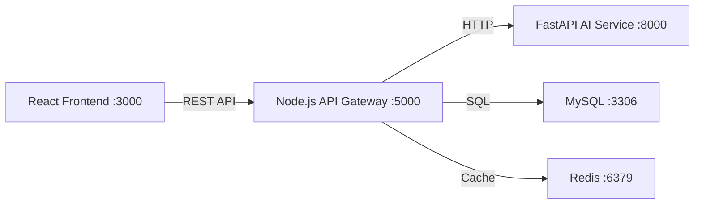

# MERI PARO — AI Career Intelligence & Job Prediction Platform

## Overview
Build a complete full-stack SaaS platform with three independently deployable services:

| Service | Tech | Port |
|---------|------|------|
| **Frontend** | React 18 + Tailwind CSS + Recharts + Zustand | 3000 |
| **Backend** | Node.js + Express + MySQL + Redis | 5000 |
| **AI Service** | Python + FastAPI + Scikit-learn + Deep Learning | 8000 |

## Architecture

> [!IMPORTANT]
> The user has provided nearly all backend + AI service source code in the prompt. The **frontend is entirely missing** and must be built from scratch with premium aesthetics. I will create all 100+ files.

## Proposed Changes

### Phase 1: Project Root & Configuration
- `docker-compose.yml` — Multi-service orchestration
- `README.md` — Setup & deployment docs

---

### Phase 2: Database
- `backend/database/schema.sql` — 11 tables with FK constraints & indexes
- `backend/database/seed.sql` — Skills, job roles, admin/test users

---

### Phase 3: Backend (Node.js + Express)

#### Config & Utils
- `backend/package.json`, `.env`, `server.js`
- `backend/src/app.js` — Express app with CORS, Helmet, Morgan
- `backend/src/config/` — env, database (mysql2), redis (ioredis)
- `backend/src/utils/` — ApiError, ApiResponse, Logger (Winston)

#### Middleware
- `auth.js` — JWT verification + role-based authorization  
- `validate.js` — express-validator integration  
- `errorHandler.js` — Global error handler  
- `rateLimiter.js` — Rate limiting (general, auth, AI)  
- `upload.js` — Multer file upload (PDF/DOCX)

#### Validators
- `auth.validator.js`, `resume.validator.js`, `prediction.validator.js`

#### Services (Business Logic)
- `auth.service.js` — Register, login, profile, JWT generation
- `resume.service.js` — Upload, parse (async), skill sync, career score
- `prediction.service.js` — Job role prediction, skill gap, job description analysis, career simulation  
- `ai.service.js` — Recommendations, dashboard data  
- `history.service.js` — User history & timeline  
- `admin.service.js` — User management, system analytics

#### Controllers & Routes
- 6 controllers + 6 route files covering auth, resumes, predictions, AI, history, admin

#### Dockerfile
- Node 20 Alpine production image

---

### Phase 4: AI/ML Service (Python + FastAPI)

#### Core
- `app/main.py` — FastAPI app with CORS, lifespan model loading
- `app/config.py` — Settings management

#### NLP Pipeline
- `app/utils/text_cleaner.py` — Text cleaning, section extraction, tokenization
- `app/utils/feature_extractor.py` — Skill extraction, education/experience/contact parsing, ATS scoring
- `app/models/skill_extractor.py` — Orchestrates NLP extraction

#### ML Models (3-Layer Architecture)
- `app/models/job_predictor.py` — **Baseline**: keyword-to-role mapping
- `app/services/ml_service.py` — **Optimized ML**: TF-IDF + Logistic Regression + Random Forest
- `app/models/deep_learning_model.py` — **Deep Learning**: Custom feedforward NN (input→256→128→64→output) with backprop from scratch
- `app/models/embeddings.py` — Sentence Transformers (`all-MiniLM-L6-v2`) for semantic similarity

#### Services
- `app/services/nlp_service.py` — Resume parsing orchestration
- `app/services/ml_service.py` — ML pipeline (train + predict)
- `app/services/dl_service.py` — DL pipeline orchestration
- `app/services/recommendation_service.py` — AI recommendation generation

#### Routes
- `resume_routes.py` — Parse resume, extract skills
- `prediction_routes.py` — Job role prediction (baseline/ML/DL)
- `recommendation_routes.py` — Career recommendations

#### Data Files
- `job_roles.json` — Role requirements mapping
- `skills_taxonomy.json` — Comprehensive skill taxonomy
- `training_data.csv` — ML training dataset

#### Dockerfile
- Python 3.11 slim + NLTK data

---

### Phase 5: Frontend (React + Tailwind) — **All New Code**

#### Foundation
- Vite + React 18 project scaffold
- Tailwind CSS v3 with custom dark theme
- Zustand for state management
- Axios instance with JWT interceptor

#### Pages (10 pages)
| Page | Description |
|------|-------------|
| `LoginPage` | Glassmorphic login with gradient background |
| `RegisterPage` | Registration with password strength indicator |
| `DashboardPage` | Career score dial, predicted roles, skill chart, progress timeline |
| `ResumeUploadPage` | Drag-and-drop upload with parsing progress indicator |
| `PredictionPage` | Model selector (baseline/ML/DL), results with confidence bars |
| `SkillGapPage` | Target role selector, gap analysis with priority chart |
| `RecommendationsPage` | AI-generated course/cert/project cards |
| `JobDescriptionPage` | JD input → skill match analysis |
| `HistoryPage` | Timeline with career score progression |
| `AdminPage` | User table, system analytics with charts |

#### Components (25+ components)
- **Layout**: Sidebar, Topbar, Layout wrapper, ProtectedRoute
- **Dashboard**: CareerScoreCard, PredictedRolesCard, SkillMatchCard, ProgressChart, MissingSkillsCard
- **Resume**: ResumeUploader (drag-drop), ResumePreview
- **Skills**: SkillGapChart, LearningPath
- **Predictions**: PredictionResults, JobMatchScore
- **Admin**: UserTable, SystemAnalytics, UsageTrends
- **Common**: LoadingSpinner, ErrorBoundary, Toast, Modal

#### Design System
- **Theme**: Dark mode with indigo/violet/cyan accent palette
- **Typography**: Inter font from Google Fonts
- **Effects**: Glassmorphism cards, gradient borders, micro-animations
- **Charts**: Recharts with custom themes (radial, area, bar, radar)

---

## Key Design Decisions

> [!IMPORTANT]
> **Tailwind CSS**: The user explicitly requested Tailwind CSS — I will use **Tailwind v3** via PostCSS.

> [!NOTE]  
> **AI Fallbacks**: Every AI endpoint has a local fallback so the system works without the Python service running.

> [!NOTE]
> **Deep Learning**: Custom NumPy-based feedforward NN is implemented from scratch (no PyTorch/TF dependency for the classifier), plus optional Sentence Transformer embeddings for semantic matching.

## Verification Plan

### Automated Tests
1. `npm install` in backend — verify no errors
2. `npm install` in frontend — verify no errors  
3. `pip install -r requirements.txt` in ai-service — verify no errors
4. `npm run dev` for frontend — verify it builds and serves
5. `node server.js` for backend — verify it starts (will warn about DB but not crash)
6. Browser test: Navigate to `http://localhost:3000`, verify login page renders with premium UI

### Manual Verification
- Visual inspection of all 10 pages via browser
- API health check endpoints
- Resume upload flow (end-to-end with fallback parsing)
